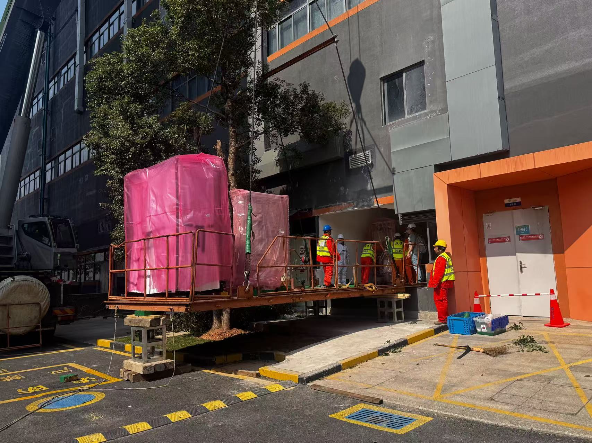
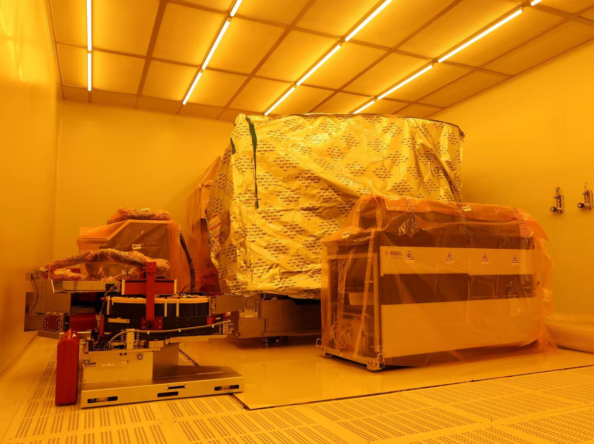

<!--more-->

We are thrilled to announce that on February 7, the i-BRAIN Nanofab officially reached a key landmark with the successful arrival and move-in of our ASML Deep Ultraviolet (DUV) lithography system. Integration of this world-class lithography platform represents a milestone in our nanofabrication facility, providing unparalleled resolution and high-precision patterning capabilities. DUV system serves as an "engine" for development of next-generation neural interfaces and high-density CMOS integration for basic research and translation of next-generation brain-computer interfaces (BCIs). 

The installation began with a meticulously coordinated effort between **i-BRAIN engineers, ASML engineers**, and a specialized precision move-in team. The logistical scale of the operation was immense, involving tens of heavy-duty shipping crates and hundreds of individual boxes containing the system's delicate components.

  

    
  

  

    
  

  
Photo by Xiaoyue Cheng (i-BRAIN) and Pei Zhao (SMART)

  
<strong>Left Photo:</strong> Captures the significant task of loading the large and heavy bottom module and the Supply & Temperature units and the system covers into the cleanroom.

  
<strong>Right Photo:</strong> Displays the main body of the stepper, which is currently protected by its silver contamination cover, with the Wafer Transfer System positioned in the foreground and the Operation Console situated to the left. These essential components form the primary interface between the scientist and the lithographic process.

With installation and system verification now aggressively underway, we are approaching the "first light" of the machine. Once fully commissioned, the ASML DUV platform will become a vibrant core facility — a collaborative powerhouse where internal research excellence meets cutting-edge industry partnerships. We are eager to see the breakthroughs this technology will enable as we push the boundaries of what is possible or even previously imagined in the neuro-technology landscape.

We thank all our partners and team members—including the SMART Lab and Equipment Department, The Infrastructure and Logistics Department, Shenzhen Jinzhan Material Supply Co., The Weiguang Campus Support Teams, The Operations and Maintenance Team—for their seamless collaboration. We especially recognize the efforts of Xiaohang Zhang, Xiaoyue Cheng, Yitong Yan, Kai Qiao, Mingxin Li, Yixi Li, Min Li, Kezheng Peng, and Xianglong Zeng in reaching this milestone.
