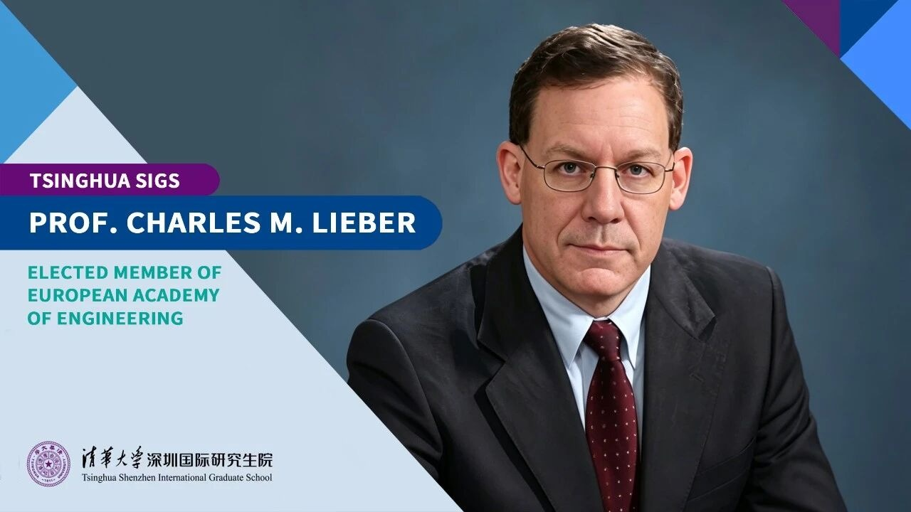

<!--more-->

Professor Charles M. Lieber, Chair Professor at Tsinghua Shenzhen International Graduate School (Tsinghua SIGS) and a leading scientist in nanoscience and chemistry, has been elected as a member of the European Academy of Engineering (EAE).

Professor Lieber is a foreign member of the Chinese Academy of Sciences and a member of the U.S. National Academy of Sciences, National Academy of Medicine, and American Academy of Arts and Sciences.

He served as Assistant and Associate Professor at Columbia University before joining Harvard University in 1991, where he was appointed Joshua and Beth Friedman University Professor in 2017, the highest faculty distinction at Harvard University. In April 2025, Professor Lieber joined Tsinghua SIGS as a full-time faculty member. He was also appointed Chair Professor at Tsinghua University and SMART Investigator at the Shenzhen Medical Academy of Research and Translation.

His research covers the rational synthesis and fundamental physics of nanoscale materials, the development of nano-bioelectronic interfaces for real-time sensing and single-cell measurements, and innovative approaches to brain science including neural activity mapping, brain-machine interfaces, and the convergence of neuroscience with artificial intelligence. He has published over 420 articles in peer-reviewed scientific journals, with more than 115,300 total citations and an h-index of 150.

Recognized as the world's top chemist by Thomson Reuters from 2000 to 2010, Professor Lieber is a pioneer in nanomaterials. He has revolutionized the rational synthesis of nanomaterials, bioelectronics, and brain-computer interfaces. His major honors include the 2012 Wolf Prize in Chemistry, the 2016 Von Hippel Award from the Materials Research Society, and the 2019 Welch Award in Chemistry.

Founded in 1992 in Gothenburg, Sweden, EAE represents one of the highest professional distinctions in engineering globally, comprising approximately 390 members across 25 countries and regions.
